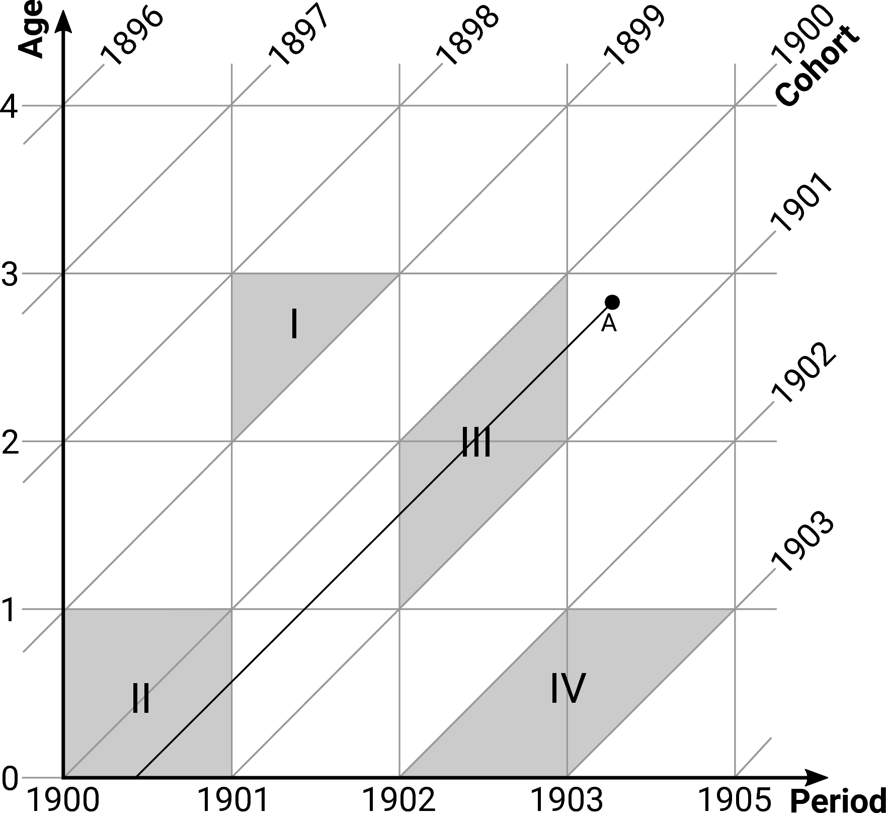
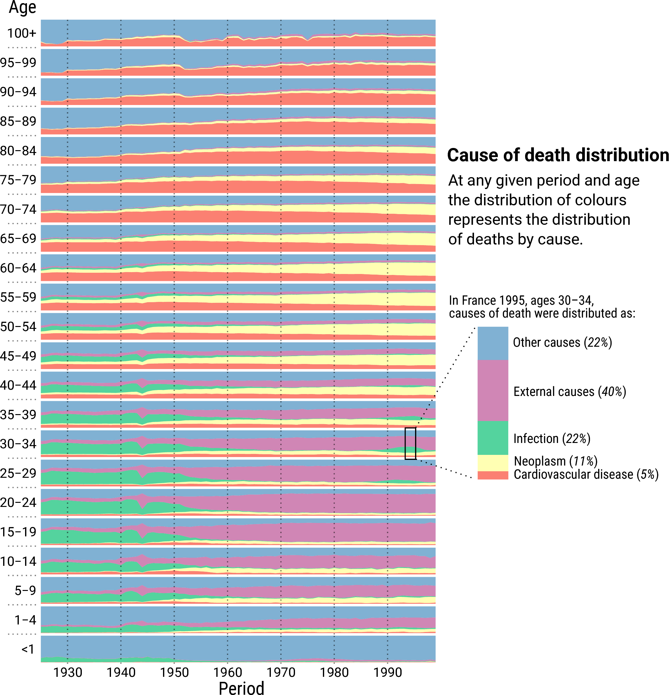
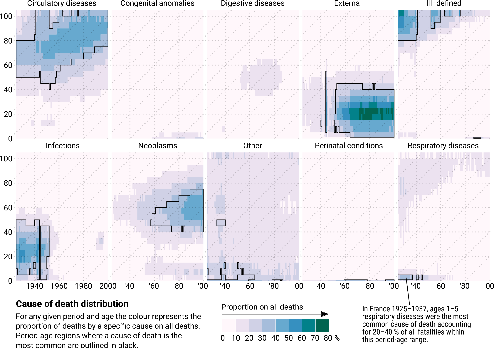
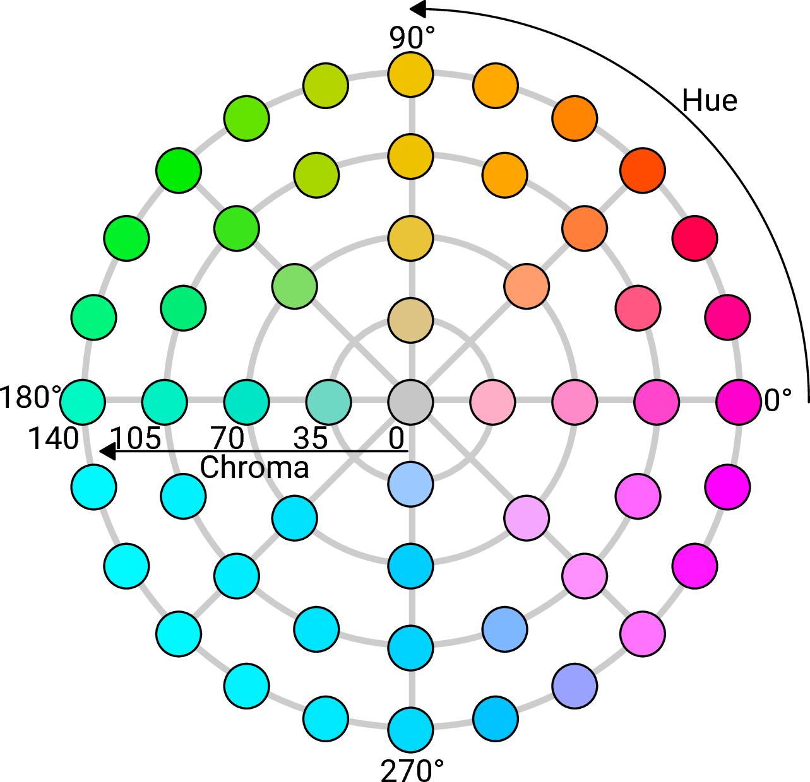
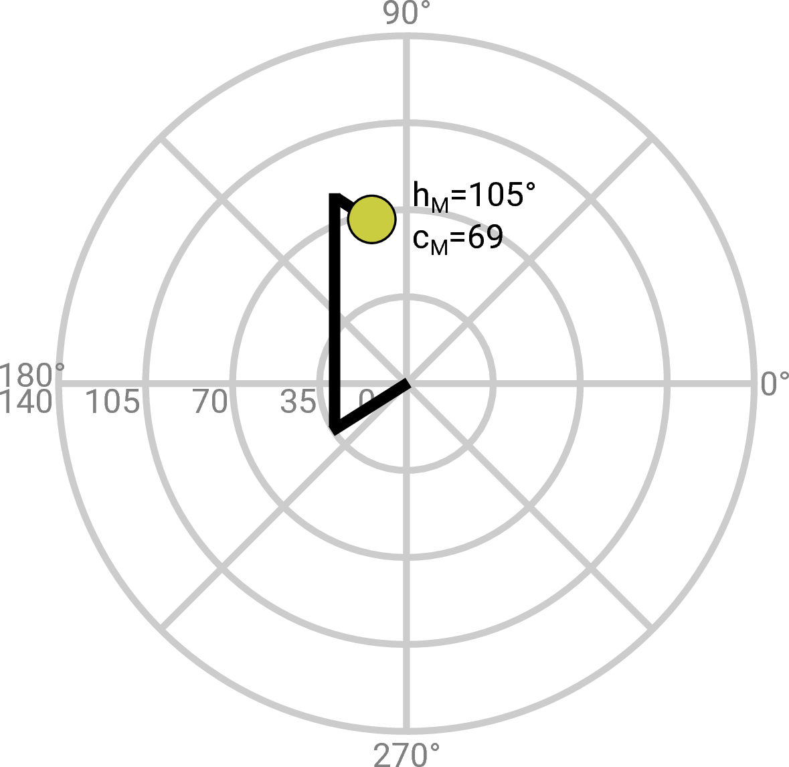
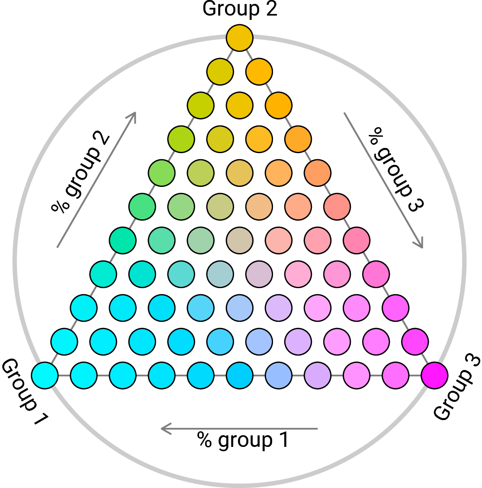
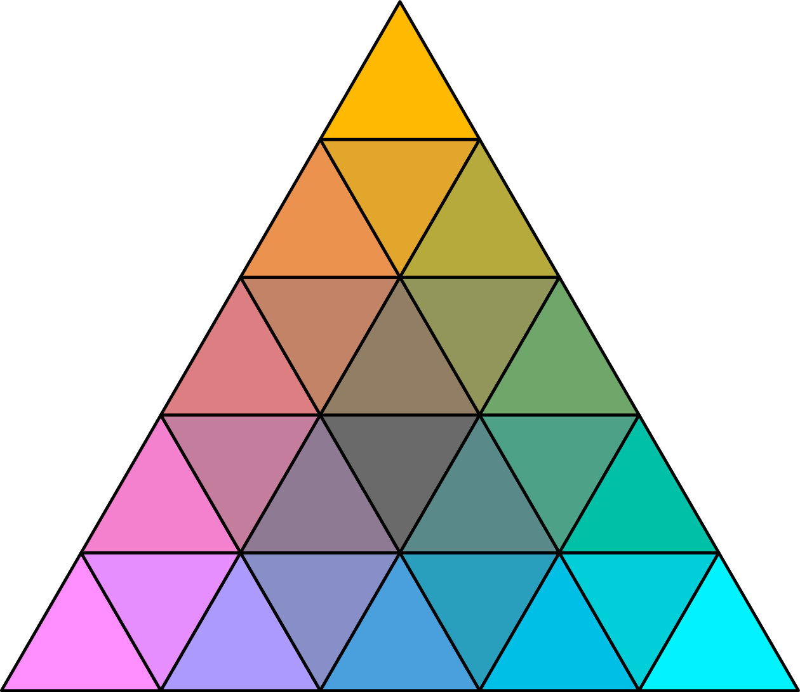

---
title: "Visualizing compositional data on the Lexis surface"
author:
  - name: Jonas Schöley
    affiliation: Max-Planck Odense Center on the Biodemography of Aging,
                 University of Southern Denmark.
  - name: Frans Willekens
    affiliation: Netherlands Interdisciplinary Demographic Institute (NIDI),
                 The Hague.
abstract: |
  The Lexis surface plot is an established visualization tool in demography.
  Its present utility however is limited to the domain of 1-dimensional
  magnitudes like rates and counts. Visualizing proportions among three or more
  groups on a period-age grid is an unsolved problem.

  We seek to extend the Lexis surface plot to the domain of compositional data.

  We propose four techniques for visualizing group compositions on a period-age
  grid. To demonstrate the techniques we use data on age-specific cause of death
  compositions in France from 1925 to 1999. We compare the visualizations for
  compliance with multiple desired criteria.

  Compositional data can effectively be visualized on the Lexis surface. A key
  feature of the classical Lexis surface plot -- to show age-, period-, and
  cohort patterns -- is retained in the domain of compositions. The optimal
  choice among the four proposed techniques depends primarily on the number of
  groups making up the composition and whether or not the plot should be
  readable by people with impaired colour vision.

  We introduce techniques for visualizing compositional data on a period-age
  grid to the field of demography and demonstrate the usefulness of the
  techniques by performing an exploratory analysis of age-specific French cause
  of death patterns across the 20$^\text{th}$ century. We identify strengths and
  weaknesses of the four proposed techniques. We contribute a technique to
  construct the ternary-balance-colour-scheme from within a perceptually uniform
  colour space.
tags: [data visualization, compositional data, Lexis surface, cause of death,
       mortality, France, apc analysis, ternary-balance-scheme,
       multivariate colour scale]
bibliography: ./refs/refs.bib
...

Introduction {#sec:intro}
============

Demography has always had a close relationship with information visualization:
From the display of population numbers by shading map regions, the graphical
representation of population dynamics on a grid of age-period-cohort parallels,
and the widely recognized population pyramid to today's interactive plots of
population data on the web:[^1] The visual display helps making sense of the
data at hand which in demography, for the most part, are counts, rates and
proportions. Visualisation methods currently used in demography focus on counts
or rates. This paper is about *compositional data*, represented by proportions,
i.e. shares of a whole. Examples of this data type are proportions within a
population (e.g. age composition, distribution by occupation, region of
residence or level of education), proportions of events (e.g. deaths by cause),
proportions of durations (e.g. life expectancy by health status), and
proportions within a total rate (e.g. death rate by cause of death).

Period- and age-specific rates and counts provide a *single value* $z$ for each
point on a period-age plane (a "Lexis surface") whereas in the case of
compositional data a *vector of values* $\langle z_1, z_2, \ldots, z_k \rangle$
having a constant sum, with length $k$ equal to the number of groups in the
composition, is given for each surface point. Therefore existing solutions for
the visualization of demographic data by period and age such as shaded contour
maps fail when confronted with compositions -- they simply run out of
dimensions. On the other hand graphs specifically designed to display
compositional data like the ternary diagram [@Aitchison1986] or the biplot
[@Gabriel1971; @Aitchison2002] do not address the basic demographic coordinates
of age, period and cohort and are therefore unsuited to show corresponding
effects in a single display.

This paper aims to extend the visual repertoire of demography by introducing and
discussing different techniques of plotting compositional data on the Lexis
surface. Hereby we hope to facilitate the exploratory analysis of compositional
data and the communication of research results in visual form. To demonstrate
the techniques we use data on age-specific death counts by cause of death in
France from 1925 to 1999 [@Vallin2014].

Four techniques are discussed in this paper. The first is the *ternary-balance-
scheme*.[^2] It allows to embed three attributes in a single colour. Each
attribute is mapped to a primary colour and the mixture of three colours shows
the composition of attributes in a population. The second technique is the
*qualitative-sequential-scheme*. In that scheme, a qualitative or categorical
variable (e.g. cause of death) is represented by a colour and the quantitative
variable (e.g. number of deaths due to that cause) is represented by sequences
of lightness steps within each colour. The third visualization, the *agewise-
area-graph*, is composed of stacked area charts drawn separately for every age
group and assembled on a Lexis-like grid. The fourth is a collection of heatmaps
portraying different subsets of the data. The resulting visualization is known
as *small-multiples*, trellis plot, lattice chart or panel chart. This
conventional technique serves as a benchmark to compare our innovations against.
Furthermore we propose a slight refinement to the small-multiple plot making it
more suitable for the display of compositional data.

The four techniques showcased in this paper mark only a tiny spot in the space
of possible visualizations concerning proportions structured by period and age.
Typically the number of effective visualizations for a given purpose is much
smaller than the number of possible visualizations [@Munzner2015] and therefore
a strategy is needed in order to arrive at viable solutions. Our final picks are
the result of multiple constraints on the design space: (1) We require the
dimensions *period and age to constitute a grid*. This is to be in-line with the
Lexis surface plot, an already established visualization tool in demography
which highlights patterns along age-, period-, and cohort time dimensions.
Demographers have build expertise in the interpretation of Lexis surfaces and by
extending these to the domain of compositional data we hope to transfer the
expertise. (2) The techniques have to *differ in their strengths and
weaknesses*. While exploring the design space we did not come across a one-size-
fits-all solution. Some visualizations can effectively show proportions among
many groups. Others are limited to compositions with few elements. Some
techniques will not work for users with impaired colour vision while others will
work flawlessly in grey scale print etc. We strive to select a collection of
solutions which cover a wide range of uses. (3) We require *techniques to be
discussed in the literature and/or commonly used to display compositions*.
Cartography, statistics and computer science are fields with a strong research
agenda on visualization and we believe that demography should tie into the
existing body of knowledge in visualization research. Furthermore,
visualizations are more easily understood if the users are already familiar with
the visual encoding.

We compare the different techniques with respect to the amount of data shown,
their geometrical preservation of the Lexis surface, their ability to
communicate precise values as well as patterns along age, period, and cohort,
their space economy and their accessibility for users with impaired colour
vision. Some evaluation criteria, like the amount of data encoded in the
visualization, can be assessed precisely. Other questions, like the ability of
the visualization to show patterns in the data, are ultimately a matter of
subjective judgements. We back up our personal assessment of these subjective
criteria by references to experiments done in graphical perception and by
demonstration of the visualizations using real world data.

The paper comprises 9 sections. In section [2](#sec:lexis) we present the Lexis
surface and explain how it is used to understand patterns in data structured by
age, period, and cohort. The techniques presented in this paper are extensions
of the Lexis surface to the domain of compositional data. Section
[3](#sec:colour) introduces some colour terminology which is used in the
subsequent demonstration of the techniques, sections 4--7. Finally we compare
the proposed visualization techniques and assess their individual strength and
weaknesses according to our evaluation criteria.

The Lexis diagram and -surface {#sec:lexis}
==============================

Between 1860 and 1880 various demographers were developing graphical techniques
to better understand population data structured by age, period, and cohort.
While one group was using diagrammatic representations of the three time
dimensions to illustrate their derivations of lifetable measures and population
dynamics, the other group produced visualizations of census data on a period-age
plane. These parallel developments culminated in what we today call the *Lexis
diagram* and the *Lexis surface*.[^3]

The *Lexis diagram* (see figure 1) connects period, age and cohort via a
Cartesian coordinate system with period on the abscissa and age on the ordinate.
For each point on this period-age plane the corresponding birth-cohort can be
calculated by subtracting age from period. This identity is illustrated with a
set of 45$^\circ$ diagonals, each connecting points belonging to the same exact
cohort. Age groups and period intervals are separated by horizontal- and
vertical parallels respectively. The resulting grid of lines helps to keep track
of individuals and populations as they progress through period and age. Imagine
a child born in the summer of 1900 and dying in the spring of 1903 just a few
months short of turning 3 years of age. A corresponding *lifeline* is shown in
figure 1 originating at birth and climbing the cohort diagonal until death at
point $A$. Start- and end-point of the line are defined by the events birth and
death, both situated at specific points in calendar time, while the line itself
measures the duration of the state "alive". Even though the term "lifeline"
suggests the study of mortality the Lexis diagram applies to all events and
processes situated in calendar time. For example, one can construct cohorts of
people having married for the first time during a certain period and measure the
duration of the marriage until divorce or the death of a partner. Multi-state
processes can be shown by segmenting the lifeline into sequences of states (e.g.
single, married, divorced, remarried, dead; see @Willekens2014 for examples).

Collecting data on many lifelines gives rise to the study of a population. In
order to construct occurrence-exposure rates,[^4] and consequently lifetables,
individual lifelines and events are aggregated over some area of the Lexis
diagram. A Lexis triangle marks an area specified by intervals over period, age
and cohort, e.g. everyone born in 1898 and dying in 1901 at the age of 2 (see
figure 1 shape I). Aggregating over intervals of period and age alone results in
a rectangular region on the Lexis diagram, e.g. everyone dying in 1900 at age 0
(see figure 1 shape II). A parallelogram with vertical lines marks an area over
a cohort and period interval, e.g. everyone born in 1900 and dying in 1902 (see
figure 1 shape III), while a parallelogram featuring horizontal lines defines
observations aggregated over a cohort and age interval, e.g. everyone born in
1902 and dying at age 0 (see figure 1 shape IV).

The Lexis diagram as a mosaic of triangles, squares or parallelograms, each
holding some aggregate statistic $z$, naturally connects to the Lexis surface as
a visualization of population data across period and age.[^5] However, both
tools have been developed independently. The earliest demographic surface plot
is a perspective drawing of Swedish population counts by period and age
published in 1860 and thus pre-dating Lexis' publication by 15 years
[@Caselli1990]. This graph was later redrawn and popularized by Luigi Perozzo
[@Perozzo1880], but, it was not until the 20$^\text{th}$ century that surface
plots became popular in the demographic literature. The pioneers @Kermack2001
and @Delaporte1942 used contour lines to indicate regions of similar mortality
levels and improvements on the period-age surface noting the emergence of
regular patterns. @Vaupel1987a[^6] demonstrated the universal utility of period-
age surfaces by plotting a wide range of measures such as between country
mortality rate ratios, population numbers, sex ratios, fertility rates or model
residuals as shaded contours across period and age with darker colours
indicating higher values. The same technique was used extensively by
@Andreev1999 to demonstrate age-heaping over time in data on high age mortality
and to describe the development of Danish mortality throughout the
18$^\text{th}$ and 19$^\text{th}$ century. Lexis surfaces have been used outside
of demography as well: @Sula2012 used them to show how publication practices
changed over historical time and the length of a researchers career. Though
concerned with different phenomena, a unifying theme in all these references is
the authors interest in *period, age, and cohort effects*.

Take for example a surface of the mortality rate sex ratio in England & Wales
(see figure 2). The excess male mortality resulting from military deaths during
the first and second world war leaves a trail on the Lexis surface in the form
two vertical bands of deep blue colour -- a classic example of a "period effect"
where a cross-section of the population is affected by an historical condition.
But we also see an interaction between period and age: The high levels of excess
male mortality during the wars are limited to the age range of men in active
military service. Starting in the mid-1950s we observe the emergence of excess
mortality among young men. This age effect is visible as a horizontal corridor
of deep blue colour and can be traced back to the effective prevention and
treatment of infectious diseases which in turn put more emphasis on the more
male dominated accidental deaths in early adulthood [@Gjonca2005]. The diagonal
colour pattern around ages 50--80 and years 1950--1980 marks a cohort effect and
can be traced back to those born at the end of the 19$^\text{th}$ and the
beginning of the 20$^\text{th}$ century. The rising popularity of smoking among
men took its toll later in life in the form of lung-cancer. Women of the same
cohorts smoked less than men and therefore gained a survival advantage. This
advantage vanished once women took up smoking as well [@Preston2006; @Beltran-
Sanchez2015].

In this paper we demonstrate the Lexis surface as a tool to explore the age,
period, and cohort structure of *compositions*.

About colour {#sec:colour}
============

We introduce colour as a multidimensional visual attribute, relate it to the
display of compositional data and introduce the colour terminology used in this
paper.

Why use colour to display compositional data on the Lexis surface? (1) Colour
can be used to visualize the value of a third variable on a plane. (2) Colour is
a visual attribute that is both inherently *compositional* as well as
*multidimensional*. Each colour can be understood as a composition of primary
colours mixed in certain proportions. The mixed colour itself is perceived as
light or dark, pale or strong, tending to red, blue, or green. Two of our
proposed techniques make use of these features: While the *ternary-balance-
scheme* employs the compositional nature of mixed colours to encode
compositional data the *qualitative-sequential scheme* maps perceptional colour
dimensions to data dimensions.

Children learn how to produce a wide range of colours by mixing blue, red and
yellow paints. The resulting colour depends on the ratio among these *primary
colours*: Mix yellow with blue to produce green, red with blue to produce purple
and three parts of yellow with one part of red to produce orange. In a case
where every unique mixture of primaries resolves into a unique mixed colour one
has effectively encoded a number of attributes (the proportions among the
primary colours) into a single attribute (the mixed colour). Assigning a primary
colour to each of three groups in the data and mixing the colours according to
the proportions among the groups is the basic idea behind the ternary-balance-
scheme (see appendix [1](sec:app-tbs) for its construction).

Another way to look at colour is in terms of perceptional features. When asked
to describe a colour it would be a remarkable feat for a person to express it as
proportions among primary colours. Instead one tends to say that a colour is
dark or light (*lightness*), pale or pure (*chroma*), and tending to red, blue,
green...(*hue*).[^7] This specification is widely used in visualization research
as it allows for the construction of *colour schemes* which reflect the
statistical features of the variables one wishes to visualize: Lightness and
chroma are perceived as ordered attributes, e.g. a random sequence of lightness
or chroma steps can easily be arranged from dark to light, from pale to pure.
Both dimensions therefore lend themselves to the display of ordered data such as
proportions (0%--100%). Different hues on the other hand do not imply order and
therefore signify mere categorical difference (blueberry|cherry). Based on this
connection @Brewer1994 proposes a typology of colour schemes: The *sequential*
and the *qualitative* scheme encode ordered and categorical data respectively.
Crossing both leads to the *qualitative-sequential scheme* -- a bivariate colour
scheme encoding the order and the category of a data point (see figure 3 for an
illustration of the Brewer schemes employed in this paper).

Ternary-balance scheme {#sec:tbs}
======================

The idea behind the *ternary-balance-scheme* is to represent the proportions
among three groups as a mixture of three basic colours each corresponding to a
single group. The basic colours are chosen so that their hues are dissimilar to
each other (e.g. magenta, yellow, cyan). They are then mixed in proportions
given by the group composition. The resulting colour mixture is unique for every
possible combination of proportions among three groups as can be shown in a
colour-coded ternary diagram serving as a legend for the ternary-balance Lexis
surface.[^8]

While using colour mixtures to encode multiple data dimensions in a single point
has been proposed several times[^9] such techniques are not in widespread use,
possibly due to the usage of legends which are not easily memorized
[@Wainer1980]. We seek to alleviate these issues by providing straightforward
interpretation guidelines along with a legend that builds upon an already
established tool in compositional data analysis -- the ternary diagram.

The dominant group at any point in time as well as the overall distribution of
the group proportions can be understood keeping two principles in mind:

  1. The higher the proportion in a group, the more the mixed colour resembles
     the base colour for that group, and
  2. the more balanced the proportions among the groups, the more the mixed
     colour tends to grey.[^10]

The ternary diagram as legend colour-codes all possible proportions among three
groups in a structured way so that each point on the Lexis surface can be
decoded into its precise proportions if needed.

Figure 4 shows the ternary-balance scheme applied to age-wise French cause of
death data across the $20^\text{th}$ century. All deaths are divided by cause
into the categories "Neoplasm" (ICD-9 codes 140--239), "External" (injury,
suicide, accident; ICD-9 codes 800--999 and E--V) and "Other" (all remaining
causes of death). Magenta was chosen as a primary colour for external causes of
death, orange for death by neoplasm and cyan encodes all remaining deaths.

Example: Consider point *A* in figure 4. The proportion of deaths caused by
neoplasm is given in the legend by the position on a horizontal line through the
region with the colour of *A*; likewise the proportion of deaths caused by
external causes is indicated by the position on a \ line and the proportions of
all other causes is indicated by the position on a / line. The mixture of
magenta, orange and cyan at point *A* indicates that 40 to 60% of the deaths
among persons of ages 55--60 in 1990 were caused by neoplasms, 0 to 20% by
external causes and the remainder of 40 to 60% by all other causes of death.

The mid-century marks a turning point. Prior to 1950 external causes of death
and cancer were only sporadically found on the death certificates, the prominent
exception being World War II. Period effects are visible in 1940 when Germany
occupied France and -- much stronger -- in 1944 after the Allied landing in
Normandy. In both years the war contributed deaths by external cause as visible
in the age range 5--60. After 1950 two major trends in the distribution of death
causes emerged: (1) Adolescent deaths rapidly became dominated by external
mortality, and (2) deaths due to cancer gradually became more common in the age
range 40--80, dominating the ages 50--70 since 1980. The onset-age of "other"
causes of death as the most prominent increased along the cohort diagonal.

The ternary-balance scheme technique allows us to identify major patterns in the
change of group composition over period and age. We are able to identify
symmetrical mixtures as well as clear monopoles among groups. Age, period and
cohort effects look much like they would on a conventional Lexis surface of all-
cause mortality rates: Local outliers show up as a sharp shift in hue --
vertical for period effects, horizontal for age effects and on a $45^{\circ}$
slope for cohort effects. Slower transitions are marked by gradual shifts in
colour.[^11] The obvious drawback of the ternary-balance-scheme is the
limitation to three distinct groups. Also, using colour as a quantifier, small
changes in the values are hard to detect and the very nature of the graph makes
it unsuitable to use for people with impaired colour-vision.

Qualitative-sequential scheme {#sec:qss}
=============================

Another form of multivariate colour scheme is the qualitative-sequential scheme
[@Brewer1994]. The idea is to use a qualitative palette of different hues to
signify group-membership and to construct a sequential palette for every group
by varying the lightness of the group-colour and thereby encoding group-specific
quantities.

See figure 5 for an example using the same dataset as in figure 4 but with two
additional categories, namely death due to infectious diseases (ICD-9 codes 001
--139) and diseases of the circulatory systems (ICD-9 codes 390--459). Each
group is assigned its own sequential colour scheme. The values given by the
colours on the Lexis surface represent the proportion of deaths from the most
prominent cause of death at period $t$ and age $x$.

This approach allows one to account for more than three groups in the
composition. The downside is an incomplete picture for every point on the Lexis
surface: Only information on the group with the highest proportion is given.
However, in a dataset with a lot of variation in the group proportions
interesting patterns emerge.

Example: Consider age group 60--65 in figure 5. Prior to 1945 we see a blue
colour: "other" causes of death were dominant. This dominance subsequently
declined (a lighter blue) until, post World War II, circulatory diseases became
the main cause of death with a proportion on all deaths of 20--40%. Around 1970
the main cause of death shifted from circulatory diseases to neoplasms (the hue
shifts from red to yellow). The dominance of neoplasms over other causes of
death for 60--65 year old males and females increased with time (the yellow hue
gets darker and more saturated).

One new insight this visualization yields is the importance of infectious
diseases as a cause of death for people aged 15--40 prior to 1950. In these
years and ages 20--60% of the deceased died from infection making this the most
likely cause of death in adolescence and middle-age. The pattern abruptly
changed after 1950 with external causes of death taking the top spot. Similar to
figure 4 we see the proportion of accident mortality on all deaths peaking
around ages 15--30.

We also get a more differentiated picture concerning causes of death in old age
which is dominated by failures of the circulatory system. Over time the onset of
circulatory conditions as the main cause of death moved into higher ages
starting at around age 60 in the 1940s to age 75 in the 1990. For people with an
extraordinarily long lifespan the causes of death are more diverse with the
group "other" in the lead.

While confined to visualizing proportions only for the most prominent group at
any given point on the Lexis surface, the qualitative-sequential scheme still
reproduces a lot of the information gained from figure 4 while adding new
insights. In cases where the dominant group does not change across the surface,
this style of visualization loses its appeal.

Agewise-area-plot {#sec:aag}
=================

The *stacked-area-plot* can be thought of as the continuous version of a
stacked-bar-chart. Coloured areas indicate group proportions which change along
the $x$-axis. As the value of each individual group proportion is indicated by
length as opposed to colour this technique is better suited to detect slight
changes in group composition over time than the previous approaches.
@Cleveland1984 show that people decode visual information into their numerical
equivalents (*table look-up*) more easily when it is represented by length and
not by colour.

For the *agewise*-area-plot (see figure 6) we produce the stacked-area-chart
separately for every age group and assemble all of them on a Lexis-like grid.
Unlike the ternary-balance-scheme technique we are able to distinguish more than
three groups and unlike the qualitative-sequential-scheme technique the full
information about the composition is displayed.

Example: One feature of the data which was hidden by the former graphical
representations is the unusual surge of fatal infectious diseases during the
1990s around ages 25--45. Looking at the exact cause of death data we see that
HIV-related deaths are the reason for this local phenomenon. Another new insight
from this plot is the relative importance of cancer as a cause for childhood
mortality.

The plot does not show a true Lexis surface. The period-age grid is
*non-continuous* as it is composed of multiple stacked-area-charts each having a
separate $y$-axis ranging from 0% to 100%. This breaks the plot area into
separate sections making the perception of global patterns harder because the
global graphical patterns (the shape of the equal-colour areas across period and
age) are interrupted along the age-scale.

The strength of the agewise-area-plot is the clear display of small local
phenomena and developments within single age groups while still giving an
overview of the global patterns for multiple groups on a single period-age grid.

Small-multiples {#sec:sm}
===============

*Small-multiples*[^12] are "tables of graphs" [@Wilkinson2005, p. 319]. Each
panel within the table represents a level of a categorical variable or an
interaction level among multiple categorical variables. Small-multiples are a
fairly common technique and have already been discussed by @Vaupel1987a as a way
of plotting Lexis surfaces for multiple sub-populations. We discuss this
technique in the context of compositional data and propose a small adjustment
facilitating cross-panel comparisons.

In figure 7 we see multiple Lexis surfaces displaying cause-specific proportions
of deaths in France across period and age. The plots are augmented by border
lines around regions within which a given cause of death is dominant.

Example: Consider the lower left panel. It shows the proportion of deaths caused
by infectious diseases by age and calendar time. Point *A* indicates that in
1930 infectious diseases are the dominant cause of death for persons aged 30--34
with 40--50% of all deaths caused by infection. Around 1950 external causes
start to become the dominant cause of death for persons aged 1--40, increasing
their proportion within that age range over time.

Unlike the other visualization techniques described in this paper the
small-multiples allow us to display the cause of death proportions among each of
the 10 most prominent categories of ICD-9. This power of course comes at a price:
The data is not contained in a single graphic. This means that the eye (and the
mind) not only have to move between and compare different regions of a plot but
make connections between different graphics in order to *grasp the whole
picture*. To make these comparisons easier we use black outlines to distinguish
regions on the period-age surface in which the corresponding cause of death has
the highest proportion among all deaths. This way there is no need for cross-
panel comparisons in telling if a given cause of death dominates over all other
at some point on the Lexis surface.

Yet again the new visualization technique shines a different light on our data
and allows for additional insights. We can see that causes of death in old age
are frequently not known: Prior to World War II an ill-defined cause of death
was the norm for people dying at ages 80+. Perinatal conditions followed by
congenital anomalies were the main causes of death for infants through most of
the 20$^\text{th}$ century in France. Prior to 1950 deaths of infants and young
children have, for the most part, been attributed to respiratory diseases. For
adults fatal respiratory diseases move into higher and higher ages, reaching a
plateau around 1970 and being nearly exclusively an old-age phenomenon from
there on. A period-age effect can be identified in the realm of digestive
diseases which contributed more than 10% of all deaths during the period 1960--1980
in ages 40--60. The latter half of the 20$^\text{th}$ century sees a rise
in the proportion of people aged 35--65 dying from conditions of the digestive
system. However, note that the data is binned into 10% categories simplifying a
correct look-up of the colour values but forbidding the exact judgement of small
differences.

Comparative evaluation {#sec:eval}
======================

In this section we evaluate and compare the four proposed techniques along the
criteria completeness, continuity, group limit, pattern perception, table
look-up, colour accessibility, and footprint.

Completeness
  : is the question of whether or not all values of the compositional
    data (e.g. all individual group proportions for each period-age) are
    displayed in the visualization or if only a subset of the group data
    (e.g. the proportion of the largest group for each period-age)
    is visualized. Visualising the complete dataset is desirable during
    exploratory data analysis.

If the visualization must contain complete information on every group in
the composition the qualitative-sequential-scheme technique is not an
option as only the group with the highest proportion at a given
period-age is considered. The remaining three techniques always show the
complete distribution of proportions.

Continuity
  : requires that the continuity of the Lexis grid is preserved in the
    visualization, e.g. the period and age axes constitute a rectangular
    grid unbroken by whitespace or period-wise/age-wise scales.

The Lexis surface constitutes a continuous grid of period and age. The
agewise-area-plot breaks this essential feature by fracturing the surface into
separate plots by age. As each age group uses its own $y$-axis the surface
becomes discontinuous along the age dimension. From a perceptional standpoint
this hinders the identification of period- and cohort effects as these would
form continuous patterns along the vertical or diagonal of the plot area but
cannot do so in the agewise-area-plot. This is not an issue for the remaining
visualization techniques.

The group limit
  : describes how many groups in the composition can be accommodated by
    a given technique. It is precise if limited by technical reasons or
    approximate if limited by perceptional reasons.

The ternary-balance-scheme technique, as the name suggests, only allows for the
display of proportions among three groups. Opposed to that the small-multiples
approach allows for the simultaneous display of a virtually unlimited number of
group proportions.

The group limit of the qualitative-sequential-scheme and the agewise-area-plots
is not restricted by technical- but by perceptional limits. The qualitative-
sequential scheme uses lightness steps within different hues to show different
group proportions. Therefore the number of groups which can sensibly be
displayed at once is limited by the number of hues one can differentiate across
varying lightness steps. @Ware2013 lists four *unique* hues: red, green, blue
and yellow. These hues are generally perceived as pure/unmixed colours which do
not resemble each other. Yellow is problematic as a base hue for a lightness
sequence as it is already a very light colour [@Ware2013, p. 127]. Orange, still
being perceived distinct from red and yellow, is the better choice here. Adding
black one can construct five sufficiently different lightness sequences. Some
few additional hues, like purple, might also work.

The agewise-area-plots contain a lot of information in a small vertical space.
The more groups are added, the more crowded this vertical space gets and
information retrieval will be more difficult.

Pattern perception
  : describes the "visual decoding of physical information"
    [@Cleveland1994, pp. 223f]. Within the context of our paper this
    translates into the degree at which age-, period-, and cohort
    effects in the composition of the data are revealed by
    the visualisation.

The ternary-balance-scheme, the qualitative-sequential-scheme and the
small-multiples techniques all show colour on a continuous surface and differ
only in the applied colour scheme. They are particularly suited to showing
patterns in the data such as period, age and cohort effects or local outliers
(as demonstrated for 1-dimensional data in @Vaupel1987a). However, for the
small-multiples approach this merit only applies to each group on its own as the
visualization is spread across multiple panels -- the inter-group patterns are
not directly visually encoded and have to be inferred from a comparison between
multiple panels. The marking of modal values eases this task.

The case for agewise-area-graphs is more complicated. Owning to the
discontinuities across the age dimension the global pattern-perception from
these graphs is comparatively worse, though changes over time within single age
groups, even small ones, can be seen very well using this approach.[^13]

Table look-up
  : "[is the] visual decoding of scale information [...]"
    [@Cleveland1994, 223f]. It takes place when attempting to extract the
    exact numbers from a displayed data point. Some visual primitives
    (such as xy-position, height, size etc.), and therefore some
    visualizations, make this task easier than others. Being able to
    easily decode the data values from a visualization is desirable as
    it allows numerical statements (e.g. "A is 2.5 times higher than
    B").

None of the techniques discussed allows for a very efficient table look-up
operation, i.e. the quick and accurate retrieval of the underlying data values.
Colour, as used by three out of the four techniques as encoding for the group
proportions, is generally regarded as the weakest graphical element in terms of
table look-up [@Cleveland1984]. The judgement of areas and lengths as used in
the agewise-area-plots fares better. For the bottom group the value can be
directly read from the y-axis. For all other areas, differences between two
points on the y-axis equal the data value.

Colour accessible
  : visualizations can be read by people with impaired colour vision.
    Most forms of colour blindness affect the ability to discriminate
    between red and green hues. In Europe the prevalence of inherited
    red-green colour deficiency is estimated to be around 8 percent
    among males and less than one percent among females [@Birch2012].
    Accessible colour palettes avoid red-green contrast and use
    lightness contrasts to make the colours distinguishable for people
    with impaired colour vision. Varying the lightness between colours
    also improves the legibility of the visualization when printed out
    in grey scale.

Only the small-multiples technique is truly accessible as it does not rely on
differences in hue to encode information but rather uses a sequential colour
scale with a strong lightness gradient to express the data. This makes
small-multiples the number one choice if the plot is to be read in grey scale or
by people with impaired colour vision. The ternary-balance-scheme on the other
hand is inherently unsuited in that regard relying heavily on the ability to
distinguish a wide range of hues from each other. The same goes for the
qualitative-sequential scheme which uses hue and lightness as independent
channels mapped to different variables. It can not be reproduced in grey scale
without losing information and will be difficult or impossible to read if colour
vision is impaired as one must correctly identify hues across different
lightness steps. A simple qualitative colour scheme is used in the age-wise-area
chart and one can choose among the many available palettes designed with colour
impaired users in mind.[^14] Still, a reproduction in grey scale will make it
harder to connect the shades of grey to their labels -- an issue which can be
resolved by using direct annotation.

The Footprint
  : is often of concern when publishing results. Some visualizations
    gain their descriptive power by occupying a large area.

The footprint of all techniques except the small-multiples is equal to a
conventional Lexis surface plot across the same period-age-range. The
small-multiples technique, depending on the number of groups, might be much
larger up to the point of filling the whole page.

------------------ ---------------------- ----------------------------- ----------------- ---------------
                   Ternary-balance-scheme Qualitative-sequential-scheme Agewise-area-plot Small-multiples
Completeness       yes                    no                            yes               yes
Continuity         yes                    yes                           no                yes
Category limit     3                      $\approx$ 5--6                $\approx 8$       unlimited
Pattern perception good                   good                          limited           good
Table look-up      limited                limited                       limited           limited
Colour accessible  no                     no                            yes               yes
Footprint          small                  small                         small             large
------------------ ---------------------- ----------------------------- ----------------- ---------------

Table 1: Evaluation of different visualization techniques for compositional data
  on the Lexis surface.

Conclusion {#sec:con}
==========

We demonstrated four different visualization techniques for showing cause of
death compositions across period and age, extending the conventional period-age
Lexis surface of 1-dimensional continuous data (e.g. surfaces of mortality
rates) to compositional data. We applied multivariate colour schemes originating
from cartography to the Lexis surface (ternary-balance-scheme,
qualitative-sequential-scheme), introduced agewise area plots as a means of
visualizing compositional change over time within ages and improved upon the
well known small-multiple technique in the context of compositional data. Each
of these techniques serves the cause of making sense of compositional data
across period and age, while at the same time these techniques complement each
other by differing in their strong points.

The ternary-balance-scheme technique is the best candidate for visualizing the
*proportions among three groups*. Using colour composition it produces smooth
rainbow-like surfaces immediately indicating period, age, and cohort patterns in
the data. The qualitative-sequential-scheme technique *extends beyond three
groups* and shows the proportions of the most dominant groups on a surface. The
agewise-area-plots use the power of the line to point out *slight, age-specific
changes* in group composition over time. Drawing a separate Lexis surface for
each level of a categorical variable is a well-tried technique and still the
most practical way to plot compositions featuring a *large number of groups*.
Adding an outline to each panel, indicating the regions of dominance of one
group over the others, reduces the need for cross-panel comparisons and
therefore further adapts this proven technique to the display of compositional
data.

What proportion of a population experiences attribute $i$ at period $t$ and age
$x$? The proposed visualizations are tools helping to answer this question. We
demonstrated the techniques using data on causes of death. Other possible
applications include period-age surfaces of population proportions by
labour-market status (unemployed and seeking job, unemployed and not seeking job,
employed), distributions of labour force over industries (agricultural,
industry, service) or partnership status (single, in relationship and living
alone, in relationship and cohabiting, married). The visualizations can also
help interpreting the output from estimated models. The Heligman and Pollard
model of overall mortality by age [@Heligman1980] for example is written as the
sum of childhood-, accident- and senescent mortality by age. The relative
magnitudes of these components can be clearly visualized using the ternary-
balance-scheme, producing graphics of quasi cause-specific-mortality from all
cause mortality data.

Good visualizations can be thought of as a visual model of the data at hand,
able to identify relationships between variables. They go hand in hand with
mathematical models of the data as both can be checked against the other. We
hope to have contributed useful techniques for revealing information about
compositions across time and age.

Acknowledgements {#sec:ack}
================

The authors would like to thank *Anna Klabunde* and *Katharina Wolf* of the Max
Planck Institute for Demographic Research for their helpful comments on the
paper, and *Anja Schöley* and *James Oeppen* for editing the draft. The research
leading to this paper was carried out at the Max Planck Institute for
Demographic Research (MPIDR), Rostock, Germany. We thank MPIDR for its support.

Appendix
========

Construction of the ternary-balance-scheme {#sec:app-tbs}
------------------------------------------

### The ternary-balance-scheme in the CIE-Lch colour space {#ssec:app-cie}

In the ternary-balance-scheme the colour mixture $\mathscr{M}$ of three primary
colours encodes the proportions within a three element compositional vector
$\textbf{p}$ (a ternary composition) with components
$\langle p_1, p_2, p_3 \rangle \in \mathbb{R}_{\geq 0}^{3} | p_1+p_2+p_3 = 1.$
The mixture is computed as a convex combination (a weighted average) of the
three primaries with weights determined by $\textbf{p}$.

There are multiple ways to construct such a ternary-colour mixture. We derive it
from within the *CIE-Lch* colour space because (1) it is parametrized in terms
of the perceptual colour dimensions lightness $l$, chroma $c$ and hue $h$, (2)
its parameters are uncorrelated with each other, and (3) the colour space is
*perceptually uniform*[^15]. These features give us great control over the final
look of the ternary-colour-scheme.

The geometry of CIE-Lch can be thought of as a cylinder with different hues
along the circumference, decreasing chroma along the radius towards the centre
and increasing lightness along the vertical axis [cp. @Fairchild2005, 185ff].
Figure 8 shows a "slice" of this cylinder with a fixed lightness level.

Let $l$ be fixed at some $l^*$ between 0 (black) and 100 (white). Each colour
within that lightness level can now be represented in polar coordinates $\langle
r = c, \phi = h \rangle$. As a basis for the convex colour mixture we choose
three primary hues $\textbf{h} = \langle h_1, h_2, h_3 \rangle$, each
representing one element of $\textbf{p}$. The hues are measured in degrees and
should be equidistant to each other, such as $\textbf{h}=(210, 90, 330)$. Given
a fixed maximum chroma value $c^* > 0$[^16] we calculate the weights of the
convex colour mixture as $\textbf{c}=\textbf{p}c^*$. This leaves us with polar
vectors $\langle \textbf{c}, \textbf{h} \rangle$ representing weighted primary
hues (see figure 9). Adding these vectors yields the hue and chroma value of
the convex colour mixture $\mathscr{M}$ (as illustrated in figure 10).

In order to add the polar vectors we need the vector components which are given
in complex form by *Euler's formula*[^17]:
$\textbf{z}=\textbf{c}\text{e}^{i \textbf{h}}$.
Adding the vector components and converting back to polar coordinates gives the
chroma and hue parameters of the convex colour mixture $\mathscr{M}$:

$$
\mathscr{M} =
  \langle
    c = \text{abs}(z_1 + z_2 + z_3),
    h = \text{arg}(z_1 + z_2 + z_3)
  \rangle.
$$

The colour mixtures of all possible $\textbf{p}$ form a triangular subset of the
CIE-Lch slice and can be conveniently labelled with a ternary scale which allows
for the numerical interpretation of each mixed-colour (see figure 11).

### A discrete ternary-balance-scheme {#ssec:disc}

Following @Derakhshan2009 we discretize a ternary composition $\textbf{p}$ by
mapping the set of all possible ternary coordinates $P$ to a subset $P_N \subset
P$ of size $N$. We perform this operation by partitioning a ternary diagram into
$N$ regular triangles (regions) and mapping the ternary composition $\textbf{p}$
to the centroid coordinates $\textbf{q}$ of the region with the closest
centroid. Border cases aside, this is the region surrounding $\textbf{p}$.

Regions in the ternary diagram are indexed by row $j$ and row-member $i$
starting from the lower left corner. The diagram is partitioned into rows
$1,\ldots,k$ and a total of $N = k^2$ regular triangles. Each row $j$ has row
members $i = 1, \ldots, (2k-2j+1)$ (see figure 12). The centroid coordinates
$\textbf{c}$ of triangle $(j,i)$ in a ternary diagram with $k$ rows are given by

$$
\textbf{c}_{ji} = \left(\frac{6k - 6j - 3i + 4 + i~\text{mod}~2} {6k},
\frac{6j - 2 - 2 i~\text{mod}~2} {6k},
\frac{3i - 2 + i~\text{mod}~2} {6k} \right).
$$

To find the nearest centroid $\textbf{q}$ for a point $\textbf{p}$ we first
calculate the distances between $\textbf{p}$ and all centroids $\textbf{c}_{ji}$
in the ternary diagram. The distance between points $\textbf{p}$ and
$\textbf{c}$ is given by

$$
\begin{aligned}
  \textbf{l} &= \textbf{p} - \textbf{c} \\
  d(\textbf{p}, \textbf{c}) &= - l_2l_3 - l_3l_1 - l_1l_2.
\end{aligned}
$$

We return the coordinates of the centroid with the lowest distance to
$\textbf{p}$.

$$
\textbf{q} = \underset{c_{ij}}{\text{arg\,min}}~d(\textbf{p}, \textbf{c}_{ij})
$$

Should $\textbf{p}$ be of equal distance to multiple centroids we randomly
choose among the nearest centroids. The colour mixture at the centroid
coordinates is then derived as shown in appendix [A1](ssec:app-cie).

Figure 12 shows a colour coded ternary diagram with $k = 5$ rows and $N = 25$
regions. The centroid of each region is labelled with row index $j$ and entry
index $i$. A ternary composition $\textbf{p}$ is discretized by mapping it to
the nearest centroid.

### Increasing contrast between colours {#ssec:lboost}

In order to improve the discriminability between colours in the ternary-balance-
scheme we increase the lightness and chroma contrast among the mixtures. This is
achieved by first rescaling chroma from range $[0, c^*]$ to $[1-\text{contrast},
1]$ and then multiplying the lightness and chroma of mixture $\mathscr{M}$ with
the rescaled chroma value to arrive at the final colour parameters. The examples
in figure \[fig:contrast\] have been derived from a CIE-Lch colour space with
$l^*=90$, and $c^*=140$.

Adding mortality contours to a compositional Lexis surface
----------------------------------------------------------

Contour lines or spatial representations can be used in combination with the
ternary-balance or the qualitative-sequential scheme in order to add an
aditional data dimension to the surface, such as mortality rates by year and
age.

References
==========

[^1]: One of the first shaded geographical maps of population densities
    can be found in @Dangeville1836. The age-period-cohort grid is
    commonly attributed to @Lexis1875 but for a full account of the
    inventors of the "Lexis"-diagram see @Vandeschrick2001. Population
    pyramids were first published by @Walker1874 whose statistical atlas
    of the ninth United States census contains a wide range of chart
    types presenting demographic data. Today, web applications like
    "Gapminder World" [@Rosling2006], "The global flow of people"
    [@Abel2014] or the "Human Mortality Explorer" [@Schoeley2016] allow
    users to actively explore the data by manipulating interactive
    plots.

[^2]: Ternary refers to a system with three states, here: a composition
    of three groups.

[^3]: See @Caselli1990, @Vandeschrick2001 and @Keiding2011 for a history
    of both techniques including reproductions of early works.

[^4]: Events divided by person-years at risk.

[^5]: @Arthur1984 introduce the term "Lexis surface" to describe a
    period-age plane of population densities. Subsequently it has been
    extended by @Vaupel1987a to visualizations of demographic quantities
    on such a surface.

[^6]: This publication has been facilitated by the work of @Gambill1985
    who developed `LEXIS`, a plotting software for personal computers
    designed to produce shaded contour maps. Today these maps can be
    created by a wide range of software. In this paper we use the R
    language for statistical computing [@R2016] in conjunction with the
    `ggplot2` package [@Wickham2016] to plot the compositional Lexis
    surfaces.

[^7]: See @Fairchild2005, chapter 4 for an introduction to colour
    terminology.

[^8]: See appendix [A](sec:app-tbs) for details on the construction of
    the ternary-balance colour scheme.

[^9]: See for example @Trumbo1981 and @Eyton1984 for bivariate data on
    geographical maps and @Ware1988 for cluster identification in
    high-dimensional spaces.

[^10]: To enable a proper differentiation between the colours we added a
    lightness contrast in addition to the chroma contrast so that more
    balanced compositions are represented by darker colours. See
    appendix \[ssec:lboost\] for further details and a comparison of
    ternary-balance-schemes with and without lightness contrast.

[^11]: Figure \[fig:tbs\_cont\] shows the French cause of death data
    visualized using a *continuous* ternary-balance scheme which is
    especially well suited for showing gradual changes in composition.
    It also works well with super-imposed contours of overall mortality
    rates, displaying not only composition but also magnitude of
    mortality across period and age. A discrete scale as used in
    figure 4 however has the advantage of pronouncing existing
    patterns in the data by introducing sharp contours between regions
    of different colours. Reducing the number of colours in the ternary
    scale also makes it easier to relate a colour on the plot to a
    colour in the legend. In appendix [A.2](ssec:disc) we describe how to
    discretize a continuous ternary composition into $N$ equally sized
    regions on a ternary diagram.

[^12]: We use the terminology of @Tufte1990. Closely related concepts
    are *facets* [@Wilkinson2005] or *trellis-plots* [@Becker1996].

[^13]: Given that no steep slopes occur or else there will be problems
    correctly judging the difference between the upper and lower
    boundary of an area [@Cleveland1994, pp. 227ff].

[^14]: See for example the web-application *Colorbrewer* [@Brewer2016]
    for a choice of colourblind safe palettes.

[^15]: Colours specified as having the same lightness, hue, and chroma
    will actually be perceived as equal in the respective dimensions.
    Furthermore, changes in the parameters of the colour space roughly
    correspond in magnitude to changes in the perceived colour predicted
    by the colour space. This property supports a truthful visual
    representation of the data at hand where similar compositions will
    be represented by similar colours and likewise dissimilar
    compositions by dissimilar colours [cp. @Ware2013, p. 105].

[^16]: CIE-Lch imposes no upper limit on the range of parameter values
    for chroma. However, not all theoretically possible colours within
    the colour space can be represented by the output device (printer,
    monitor). $c^*$ and $l*$ have to be chosen such that all the colours
    within the CIE-Lch slice can actually be displayed.

[^17]: Note that at this point $\textbf{h}$ has to be converted from
    degrees to radians. Once the colour mixture $\mathscr{M}$ is
    calculated, the hue parameter can be converted back into degrees.
